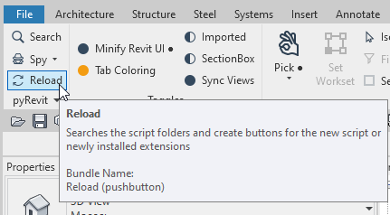

<h2>pyRHI extension for Revit / Расширение pyRHI для Revit<h2>

<h3>Dependencies / Зависимости :<h3>

- Revit 2019+
- pyRevit 4.8.8 +

**Main functions / Основные функции**

Основные функции представленны на панели RHI. Если навести на кнопку на панели, то появится описание функции и условия его выполнения. 

**Version / Версия**

Предварительная версия v0.1.3  
Часть функций на данный момент находится в разработке.

**First Install notice guide / Руководство при первой установке**

1. Make sure that `%APPDATA%\pyRevit\Extensions\RHI.extension` is empty or does't exist  / Убедитесь что директория `%APPDATA%\pyRevit\Extensions\RHI.extension` пустая либо не существует
2. Start the Setup file and follow the installer instruction / Запустите установочный файл и проследуйте указаниям установщика до конца.
3. Open Revit, on the pane you would notice new RHI tab / Запустите Revit, на панели появится новая вкладка RHI

*When installing it is possible to run Revit. After indtallation in order to apply changes you should restart pyRevit (Image 1)*

*При установке не обязательно закрывать Revit. Для применения изменений перезапустите интерфейс Revit на вкладке pyRevit (Image 1)*

**Unistall / Удаление**

To Unistall the product you need:
1.  to open the Control Panel 
2.  find RHI extension and then 
3.  proceed with Unistall process 

Для того, чтобы удалить приложение, необходимо:
1. открыть Панель управления, 
2. найти расширение 
3. запустить процесс удаления

